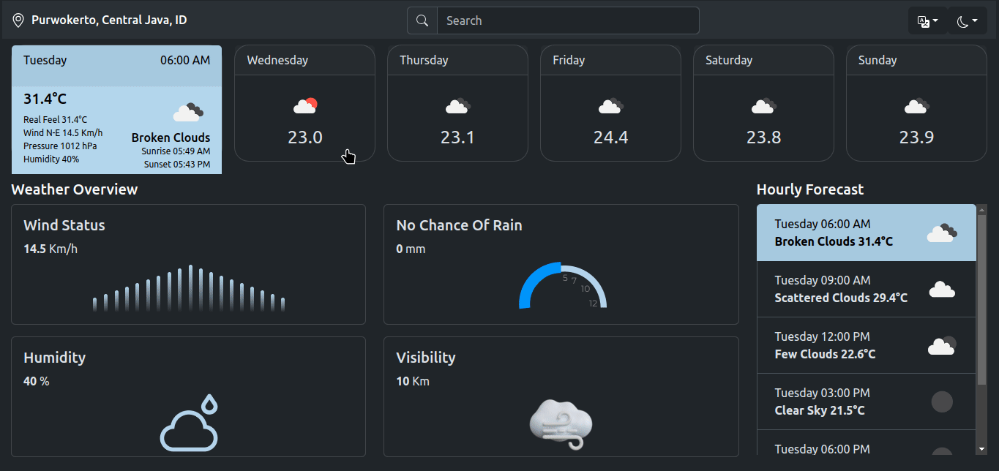

## Weather App
A React JS weather application that allows users to search for locations worldwide and view current and forecasted weather information. The app also provides options to switch between light and dark themes and change the app’s language.

### Demo
You can try out a live demo of the Weather App [here](https://tegarsubkhan236.github.io/react-weather-app/).

### Features
- <b>Location Search</b>: Search for any location around the world to view weather information.
- <b>Weather Forecast</b>: View the weather forecast for today and up to 5 days ahead.
- <b>Theme Switching</b>: Toggle between light and dark themes to customize the app’s appearance.
- <b>Language Switching</b>: Change the app’s language between English (EN) and Indonesian (ID).

